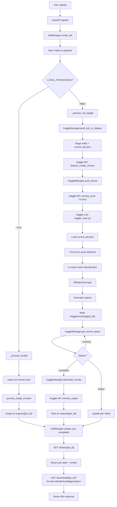

# Atletico Intelligence

AI-powered soccer incident review platform for grassroots leagues. Offside and goal-line decisions, analyzed from match footage in under 10 seconds - at zero infrastructure cost.

---

## Problem Statement

Small leagues cannot afford VAR systems. Referees make offside and goal-line decisions in real time with no technology support. Post-match disputes have no reliable video evidence.

This platform processes match video in a Kaggle Kernel (free T4 GPU), extracts the incident clip, applies pose-based computer vision, and returns a verdict with a positional diagram - shareable in seconds.

---

## Status

| Phase | Item | State |
|---|---|---|
| Phase 1 | Kaggle Kernel pipeline | Complete |
| Phase 1 | YOLOv11x-pose detection | Complete |
| Phase 1 | Offside logic (foot x-coord) | Complete |
| Phase 1 | Goal-line logic (ball crossing) | Complete |
| Phase 1 | H.264 annotated clip output | Complete |
| Phase 1 | 3D positional diagram (PNG) | Complete |
| Phase 1 | Structured JSON verdict | Complete |
| Phase 2 | Web UI (upload + result viewer) | In progress |
| Phase 3 | Self-hosted production server | Planned |

---

## Architecture

### Execution Model

```
Match Footage (local)
        |
        | kaggle-cli upload
        v
Kaggle Dataset (input/)
        |
        | Kaggle Kernel (T4 x2 GPU)
        v
  src/kernel/main.py
        |
        |-- 1. Extract full annotated clip
        |-- 2. Freeze incident frame
        |-- 3. YOLOv11x-pose inference (17 keypoints)
        |-- 4. Classify teams (K-means on jersey color)
        |-- 5. Offside or goal-line analysis
        |-- 6. Generate 3D positional diagram
        |-- 7. Write verdict JSON + PNG + MP4
        |
        v
Kaggle Dataset (output/)
        |
        | kaggle-cli download
        v
Results (clip, verdict, diagram, logs)
```

### System Design Flowchart



### Module Breakdown

| Module | Responsibility |
|---|---|
| `main.py` | Orchestrates pipeline; reads config; writes all outputs |
| `video_processor.py` | Loads video, extracts frame, writes annotated clip |
| `object_detector.py` | YOLOv11x-pose inference; returns bboxes + 17 keypoints per player |
| `offside_logic.py` | Classifies teams; compares foot x-coordinates; returns ONSIDE/OFFSIDE |
| `goal_logic.py` | Detects ball crossing relative to calibrated goal line |
| `ball_detector.py` | Isolated ball detection for goal-line analysis |
| `annotator.py` | Draws bboxes, offside line, team colors, verdict overlay on frames |
| `visual_generator.py` | Renders top-down 3D diagram (matplotlib) for offside and goal incidents |
| `config.py` | Environment detection (Kaggle vs local); all path and threshold constants |

---

## Tech Stack

| Layer | Tool | Reason |
|---|---|---|
| Detection | YOLOv11x-pose | 17 keypoints per player; foot position precision for offside |
| Tracking | ByteTrack | Stable player ID across frames |
| Video | OpenCV 4.x | Frame extraction, H.264 encoding, annotation |
| Team assignment | K-means (scikit-learn) | Robust jersey-color classification, no labeled data needed |
| Visualization | Matplotlib | Top-down 3D diagrams without a render server |
| GPU runtime | Kaggle Kernel T4 x2 | Free tier; ~40 hours/month; zero ops overhead |
| Package manager | UV | Deterministic lockfile; fast installs |
| Backend (Phase 2) | FastAPI + Uvicorn | Async-native; minimal overhead; auto OpenAPI docs |

---

## Directory Structure

```
offside-detection-tracking/
├── src/
│   ├── kernel/                     # Kaggle Kernel entry point
│   │   ├── main.py                 # Pipeline orchestrator
│   │   ├── config.py               # Path + threshold config
│   │   └── modules/
│   │       ├── video_processor.py
│   │       ├── object_detector.py
│   │       ├── offside_logic.py
│   │       ├── goal_logic.py
│   │       ├── ball_detector.py
│   │       ├── annotator.py
│   │       ├── visual_generator.py
│   │       ├── validators.py
│   │       ├── logger.py
│   │       └── constants.py
│   ├── backend/                    # Phase 2: FastAPI wrapper
│   └── frontend/                   # Phase 2: Web UI
├── kaggle-kernel/                  # Kaggle notebook metadata
│   ├── kaggle_main.py
│   └── kernel-metadata.json
├── input/                          # Local dev: video inputs
├── output/                         # Local dev: results
├── models/                         # YOLO weight files
├── tests/                          # Unit + integration tests
├── scripts/                        # Utility scripts
├── .docs/                          # All architecture decisions (markdown)
├── pyproject.toml                  # Dependencies (UV managed)
├── bytetrack.yaml                  # ByteTrack tracker config
└── run.py                          # Local run launcher
```

---

## Local Development Setup

### Prerequisites

- Python 3.10-3.12
- UV package manager
- CUDA-compatible GPU (recommended; CPU works for testing)

### Install

```bash
# Clone
git clone https://github.com/shakilmosharrof/offside-detection-tracking.git
cd offside-detection-tracking

# Install UV
pip install uv

# Create venv and install dependencies
uv sync

# Download YOLO model weights
# Place yolo11x-pose.pt in models/
```

### Run Locally

```bash
# Process video in local mode (reads from input/, writes to output/)
uv run python src/kernel/main.py

# Or use the launcher (Gradio MVP mode)
uv run python run.py
```

### Run Tests

```bash
uv run pytest tests/ -v
```

---

## Kaggle Execution

### One-time Setup

```bash
# Install Kaggle CLI
pip install kaggle

# Place kaggle.json at project root (never commit)
# Get it from: https://www.kaggle.com/settings/account
```

### Workflow

```bash
# 1. Upload video to Kaggle dataset
kaggle datasets files shakilmosharrof/athletic-intelligence-dataset
kaggle datasets upload -p input/

# 2. Run Kaggle Kernel
# Navigate to: https://www.kaggle.com/code
# Select kernel, click Run All

# 3. Download results
kaggle datasets download shakilmosharrof/athletic-intelligence-dataset
```

### Input Format

Place your incident specification in `input/incidents.json`:

```json
[
  {
    "video": "match_001.mp4",
    "frame_number": 450,
    "incident_type": "offside"
  }
]
```

### Output Structure

```
output/
└── match_001/
    ├── clip_offside.mp4        # Annotated full clip
    ├── freeze_offside.png      # Annotated freeze frame
    ├── diagram_offside.png     # Top-down 3D diagram
    ├── results.json            # Verdict + confidence + paths
    └── processing.log          # Structured run log
```

### Verdict JSON

```json
{
  "status": "completed",
  "verdict": "OFFSIDE",
  "confidence": 0.87,
  "clip_path": "output/match_001/clip_offside.mp4",
  "diagram_path": "output/match_001/diagram_offside.png",
  "freeze_path": "output/match_001/freeze_offside.png",
  "error": null
}
```

---

## Offside Logic

```
Attacker is OFFSIDE if:
  attacker.foot_x > second_last_defender.foot_x

Where:
  foot_x = x-coordinate of the leading foot keypoint (YOLOv11x-pose kp 15 or 16)
  second_last_defender = the defender closest to goal, excluding goalkeeper
```

Team classification runs K-means on the dominant color in the top half of each player bounding box. Defenders and attackers are assigned by their x-position relative to the ball at the moment of the pass.

---

## Performance

| Step | Target | Achieved |
|---|---|---|
| Clip extraction | < 2s | ~1s |
| YOLO inference (frozen frame) | < 5s | 3-5s on T4 |
| Offside/goal logic | < 1s | < 0.5s |
| Diagram generation | < 2s | ~1s |
| Total per incident | < 10s | 6-9s on T4 |

---

## Constraints

| Constraint | Detail |
|---|---|
| No full video distribution | Clips only - IP protection for clubs |
| Kaggle free tier | 40 GPU hours/month; single concurrent kernel |
| No server in Phase 1 | Batch processing only; no API |
| Manual frame selection | Official identifies incident frame offline |
| Single-camera input | No multi-angle triangulation in MVP |